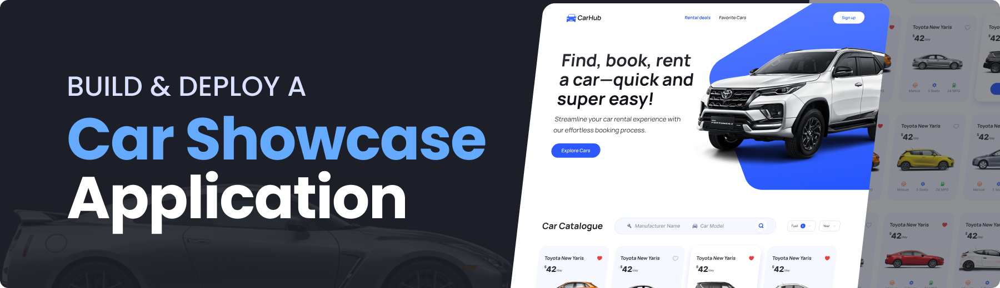

 

    

###

Desenvolvido com Next.js e aproveitando suas capacidades de renderização do lado do servidor, o site Car Showcase apresenta diversos tipos de carros, exibindo informações abrangentes em um formato bem elaborado, com suporte avançado para filtragem e paginação, proporcionando uma experiência aprimorada para o usuário.

###

<h2 align="left" style="color:white;" >💻 Tecnologias </h2>

###

  
 

###

<h2 align="left" style="color:white;">🔋 Características</h2>

###
👉 **Página inicial**: apresenta uma exibição visualmente atraente de carros obtidos de uma API de terceiros, fornecendo uma introdução cativante à diversificada gama de veículos disponíveis.

👉 **Exploração e Filtragem**: Explore uma grande variedade de carros de todo o mundo, utilizando um sistema de pesquisa e filtro baseado em critérios como modelo, fabricante, ano, tipo de combustível e marca.

👉 **Transição para renderização no lado do servidor**: uma transição perfeita da renderização no lado do cliente para a renderização no lado do servidor, melhorando o desempenho e proporcionando uma experiência de navegação mais suave.

👉 **Paginação**: para facilitar a navegação por um grande conjunto de dados de carros, permitindo que os usuários explorem várias páginas sem esforço.

👉 **Otimização de Metadados e SEO**: Otimize metadados para listagem de carros, aprimorando a otimização de mecanismos de busca (SEO) e garantindo melhor visibilidade nas páginas de resultados de buscas.

👉 **Tipos TypeScript**: Utilize TypeScript para fornecer digitação robusta para maior qualidade de código e melhor desenvolvimento

👉 **Design de site responsivo**: O site foi projetado para ser visualmente agradável e responsivo, garantindo uma experiência ideal ao usuário em vários dispositivos.

e muito mais, incluindo arquitetura de código e capacidade de reutilização

###

<h2 align="left" style="color:white;" >🌐 Minhas redes sociais</h2>

###

  
  
  

###

## Autor

<a href="https://github.com/account" align="center" >
 
  
 <b>João Victor Fonseca</b></a> <a href="https://github.com/joao-victor-fonseca" title="perfil">🚀
 </a>

Feito com ❤️ por João Victor Fonseca Assis 👋🏽 Entre em contato!
